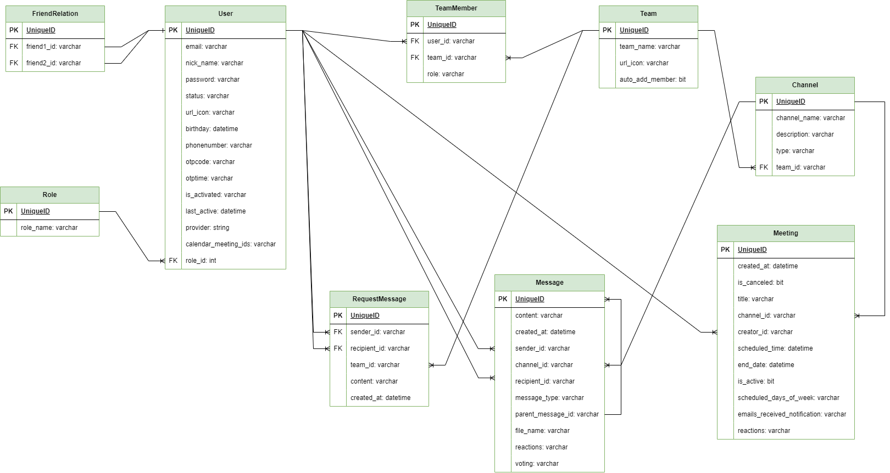

# MeetingTeam App

Building a chat website using ReactJS and Spring boot. This build covers basic funtionalities of a video call application such as sending and receiving text messages, uploading files and video call (using Zegocloud API)

## Tentative technologies and frameworks
 - Java 17
 - Spring boot 3
 - ReactJS
 - RabbitMQ
 - ZegoCloud API (video call feature)

### Architecture

1. This is the architect of the MeetingTeam project:

2. This is the database design of the MeetingTeam project:

3. Deploy the application in a kubernetes cluster on Google Cloud Platform

4. Apply ELK stack to manage logs of k8s cluster

